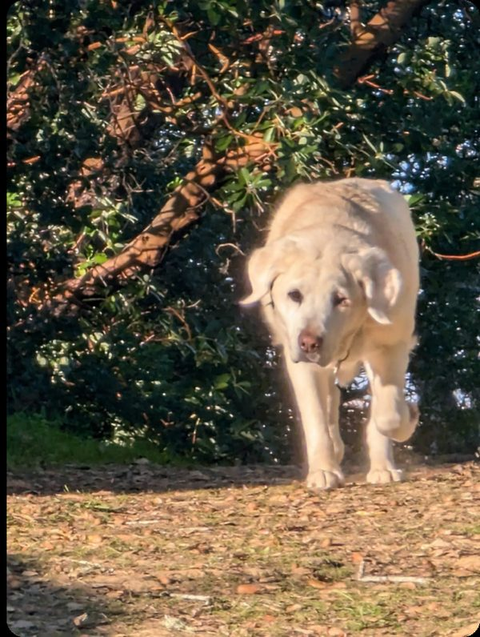

# The Tales of Della & Oban — Project Guide

## What this is

A storybook website built from real text messages. Byron Deme is the Lopin family's dog walker in Marin County, CA. For over a year he sent the family elaborate fictional dispatches — written as if narrating the secret adventures of their two dogs, **Della** (a cream/white Labrador) and **Oban** (a black Lab mix) — after every walk. The family loved them. This site collects all of Byron's messages into a beautiful illustrated storybook.

The source material was a 514MB PDF export of the Apple Messages conversation thread. Byron's messages were extracted and organized into four chapters covering December 2024 through April 2026. The story ends with Della passing away on January 31, 2026.

---

## Live site

**https://della-and-oban.onrender.com**

Deployed as a static site on Render, auto-deployed from GitHub.

**GitHub repo:** `https://github.com/adampenn/della-and-oban`

---

## File structure

```
index.html          — Book cover / table of contents
chapter1.html       — Chapter 1: Dec 2024–Jun 2025 (47 stories, warm brown theme)
chapter2.html       — Chapter 2: Jul–Oct 2025 (24 stories, forest green theme)
chapter3.html       — Chapter 3: Nov–Dec 2025 (16 stories, midnight blue theme)
chapter4.html       — Chapter 4: Jan–Apr 2026 (23 stories, warm gold theme)
photos/             — 10 curated story photos (JPEGs, ~50–145KB each)
```

Each HTML file is fully self-contained (CSS inline in `<style>` tags, no external JS).

---

## The characters

- **Della** — Cream/white Labrador. The schemer. Motivated entirely by food (baby carrots, shrimp, pizza). Runs for office, commits bank robbery, casts wiccan spells. Dies January 31, 2026.
- **Oban** — Black Lab mix. The accomplice. Obssessed with squirrels, unexpectedly good at crime, briefly flies to Quebec under mysterious circumstances. Continues as the sole subject after Della's passing.
- **Byron Deme** — The dog walker. The narrator. Consistently outwitted.
- **The Lopin family** — Kelsey, Chris, Kaitlin, Thomas. They react in the thread (usually with laughing emojis and genuine delight).

---

## Story HTML structure

Each story looks like this:

```html
<div class="story">
  <div class="story-header">
    <span class="story-date">DEC 28, 2024</span>
    <h2 class="story-title">The Great Pizza Heist</h2>
  </div>
  <div class="story-body">
    <p>Story text here...</p>
    <p class="reaction"><strong>Kelsey:</strong> "Hahaha"</p>
  </div>
  <!-- Optional photo, inserted after story-body closing tag: -->
  <figure class="story-photo">
    
    <figcaption>Caption text</figcaption>
  </figure>
</div>
```

The `.reaction` class (italic, left-border quote style) is used for family replies in the thread.

The `.pullquote` class is available for Byron's especially good one-liners.

---

## Photos

10 curated photos are embedded in the storybook, matched to specific stories:

| File | Story | Chapter |
|------|-------|---------|
| `photos/della_scheming.jpg` | The Great Pizza Heist | 1 |
| `photos/della_charging.jpg` | Gas Station Carrots | 1 |
| `photos/della_slumber.jpg` | The Slumber Report | 1 |
| `photos/the_spider.jpg` | The Spider Hotel | 1 |
| `photos/della_theatrical.jpg` | Air Bud 27: Iron Chef | 1 |
| `photos/both_conspiring.jpg` | The Planning Session | 2 |
| `photos/della_striding.jpg` | Della's Campaign Announcement | 2 |
| `photos/oban_alert.jpg` | Oban's Private Plane | 3 |
| `photos/della_sleeping.jpg` | A Note About Flowers (farewell) | 4 |
| `photos/oban_smiling.jpg` | The Mugging (Oban's Version) | 4 |

All 287 extracted photos from the original PDF are available at:
`/sessions/busy-adoring-hawking/raw_images/img-1392.png` through `img-1968.png`
(only even-numbered files in that range are real photos — odd-numbered are skipped)

---

## How to push changes to GitHub

Use the GitHub Contents API with the Personal Access Token. Here's a Python pattern:

```python
import base64, json, urllib.request

TOKEN = "YOUR_GITHUB_PAT_HERE"  # Ask Adam for the token, or find it in previous chat sessions
REPO = "adampenn/della-and-oban"

def get_sha(path):
    req = urllib.request.Request(f"https://api.github.com/repos/{REPO}/contents/{path}")
    req.add_header('Authorization', f'token {TOKEN}')
    with urllib.request.urlopen(req) as resp:
        return json.loads(resp.read())['sha']

def push_file(path, local_path, message):
    sha = get_sha(path)
    with open(local_path, 'rb') as f:
        content = base64.b64encode(f.read()).decode('utf-8')
    payload = json.dumps({"message": message, "content": content, "sha": sha}).encode()
    req = urllib.request.Request(
        f"https://api.github.com/repos/{REPO}/contents/{path}",
        data=payload, method='PUT'
    )
    req.add_header('Authorization', f'token {TOKEN}')
    req.add_header('Content-Type', 'application/json')
    with urllib.request.urlopen(req) as resp:
        result = json.loads(resp.read())
        print(f"Pushed: {result['content']['name']}")

# Example:
push_file("chapter1.html", "/sessions/.../mnt/outputs/chapter1.html", "Update chapter 1")
```

Render auto-deploys from the `main` branch within ~1 minute of a push.

---

## Chapter themes (CSS color palettes)

| Chapter | Primary BG | Accent | Header gradient |
|---------|-----------|--------|-----------------|
| 1 | `#FDF8EF` | `#c8a951` (gold) | `#3d1f0e → #6b3520` (warm brown) |
| 2 | `#F0F5EE` | `#5a8a5a` (forest green) | `#1a3320 → #2d5a2d` |
| 3 | `#EEF0F5` | `#6a7fa8` (slate blue) | `#0e1a2e → #1e3050` |
| 4 | `#F5F2E8` | `#b8922a` (warm gold) | `#2e1f0a → #5c3d0e` |

---

## Key story arcs (for context)

- **The Air Bud Chronicles** (Mar–Jun 2025, Ch1): Della and Oban get cast in *Air Bud 27: Iron Chef — Air Chef vs. Air Judge (the Musical)*. Ryan Gosling gets written in as the secret ingredient. Della blackmails the producer so the soundtrack is entirely her barking.
- **The Airport Trilogy** (Nov–Dec 2025, Ch3): Three-part noir story about Oban secretly flying to Quebec to eat a gingerbread man as part of a mutual-aid scheme with a stranger from the groomer.
- **Della's Political Campaign** (Aug 2025, Ch2): Pre-emptive denial of all allegations.
- **The Farewell** (Jan 31, 2026, Ch4): Byron drops off flowers. Kaitlin thanks him. He says if a book ever gets made, he'd dedicate it to Della — "my muse. And sometimes bully when I was near a carrot."

---

## Source data location

The raw extracted text is at:
`/sessions/busy-adoring-hawking/byron_text.txt`
(2177 lines, ~77KB — all messages from the thread in chronological order)

The original PDF is at:
`/sessions/busy-adoring-hawking/mnt/uploads/byron full.pdf`
(514MB, 260 pages — the Apple Messages export)
